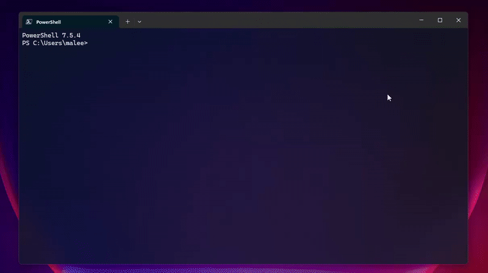

# DevBase v1.7.17

**DevBase** is a high-performance CLI project manager built with Go, featuring optimistic UI updates, concurrent directory scanning, and seamless VS Code integration.



## 🚀 Features

- **⚡ Optimistic UI Updates** - Instant visual feedback with automatic rollback on errors
- **🔍 Intelligent Project Discovery** - Automatically finds Go, Node.js, and Git repositories
- **📊 SQLite Database** - WAL mode enabled for maximum performance with optimized connection pooling
- **🔄 Git Integration** - Shallow cloning for fast project restoration and GitHub repository cloning
- **⚙️ Concurrent Scanning** - Worker pool pattern (10 goroutines) for lightning-fast directory traversal
- **💻 VS Code Integration** - One-key project opening with automatic last-opened timestamp tracking
- **🎨 Beautiful TUI** - Built with Bubble Tea for a modern terminal experience
- **☁️ Cloud Sync** - GitHub OAuth authentication with Gist backup/restore functionality
- **🔐 Secure Authentication** - OAuth Device Flow (no manual token creation needed)
- **📁 Multi-Root Support** - Manage multiple root directories and switch between them seamlessly
- **🗂️ Project Archiving** - Archive projects to free up disk space, restore with one command
- **🌐 Browser Integration** - Open GitHub repositories directly from the TUI
- **▶️ Quick Run** - Execute projects in development mode with automatic terminal launching
- **🔍 Real-time Search** - Filter and search projects instantly with built-in fuzzy search
- **🏷️ Smart Tagging** - Organize projects with custom tags
- **🔒 Confirmation Dialogs** - Safe delete operations with "DELETE" confirmation
- **🎯 Selective Cloud Restore** - Choose specific projects to restore from cloud backups

## 📦 Installation

### Quick Install (Recommended)

#### Windows
**Option 1: Windows Installer (Easiest - Auto-adds to PATH)**
1. Download `devbase-windows-installer.exe` from [latest release](https://github.com/maleesha-pramud/devbase/releases)
2. Run the installer
3. Restart your terminal
4. Done! Use `devbase` command from anywhere

**Option 2: PowerShell Script**
```powershell
iwr -useb https://raw.githubusercontent.com/maleesha-pramud/devbase/main/install.ps1 | iex
```

#### Linux / macOS
```bash
curl -fsSL https://raw.githubusercontent.com/maleesha-pramud/devbase/main/install.sh | bash
```

### Alternative Installation Methods

#### Install with Go
```bash
go install github.com/maleesha-pramud/devbase/cmd/devbase@latest
```

#### Manual Installation from Releases

1. Download the latest release for your platform from [GitHub Releases](https://github.com/maleesha-pramud/devbase/releases)
2. Extract the archive:

**Linux/macOS:**
```bash
tar -xzf devbase-*.tar.gz
sudo mv devbase /usr/local/bin/
```

**Windows:**
- Extract `devbase-windows-amd64.zip`
- Move `devbase.exe` to a folder in your PATH (e.g., `C:\Program Files\DevBase\`)
- Add the folder to your System PATH

#### Build from Source
```bash
git clone https://github.com/maleesha-pramud/devbase
cd devbase
go build -o devbase ./cmd/devbase
# Move binary to your PATH
```

**Note:** DevBase stores its database file (`devbase.db`) in your home directory (`~/devbase.db` on Unix-like systems, `%USERPROFILE%\devbase.db` on Windows). This allows you to run the `devbase` command from any directory.

## 🗑️ Uninstallation

### Quick Uninstall

#### Linux/macOS
```bash
sudo rm /usr/local/bin/devbase        # Remove binary
rm ~/devbase.db                        # Remove database (optional)
```

**Windows:**
- **Installer:** Run the uninstaller from "Add or Remove Programs" or `devbase-windows-installer.exe` (uninstall option)
- **Manual:** 
  ```powershell
  Remove-Item -Path "$env:LOCALAPPDATA\Programs\DevBase" -Recurse -Force  # Remove binary
  Remove-Item -Path "$env:USERPROFILE\devbase.db"                        # Remove database (optional)
  # If installed via installer, PATH is auto-removed. Otherwise manually remove from PATH.
  ```

### If installed via Go
```bash
rm $(which devbase)     # Linux/macOS
rm ~/devbase.db         # Remove database (optional)
```

## 🎮 Usage

### Interactive Mode (Default)
```bash
devbase
```

### Commands
```bash
devbase --help      # Show help information
devbase --version   # Show version
devbase scan        # Scan directories (interactive mode)
```

## ⌨️ Keyboard Shortcuts

### Main View
| Key | Action |
|-----|--------|
| `Enter` | Open project in VS Code |
| `o` | Open GitHub repository in browser |
| `x` | Run project in development mode (opens new terminal) |
| `s` | Scan for new projects in current root folder |
| `g` | Clone a GitHub repository |
| `t` | Authenticate with GitHub OAuth (for cloud sync) |
| `u` | Sync projects to GitHub Gist (upload) |
| `l` | Select and load projects from cloud |
| `f` | Manage root folders (add/remove/switch) |
| `c` | Clear all projects (requires confirmation) |
| `d` | Archive project (deletes directory, requires typing "DELETE") |
| `r` | Restore archived project (clones from repo) |
| `/` | Filter/search projects (fuzzy search) |
| `ESC` | Cancel confirmation dialogs |
| `q` or `Ctrl+C` | Quit |

### Root Folder Management (`f` key)
| Key | Action |
|-----|--------|
| `Enter` | Set selected folder as active |
| `a` | Add new root folder |
| `d` | Delete root folder and all its projects |
| `s` | Scan selected root folder for projects |
| `ESC` | Return to main view |

### Cloud Project Selection (`l` key)
| Key | Action |
|-----|--------|
| `Space` | Toggle project selection |
| `Enter` | Load selected projects as archived |
| `ESC` | Cancel and return to main view |

## 🏗️ Architecture

### Modules

- **`models/`** - Data structures with GORM tags
  - `Project` - Project metadata with path, repo URL, status, tags
  - `RootFolder` - Root directory management with active folder tracking
  - `Config` - Application configuration key-value store
- **`db/`** - Database layer with optimized SQLite configuration
  - WAL mode, connection pooling, prepared statement caching
  - CRUD operations for projects, root folders, and config
  - Automatic filtering by active root folder
- **`engine/`** - File system operations, Git integration, and scanning
  - Concurrent directory scanner with worker pool pattern
  - Archive/restore operations with directory management
  - Git cloning with shallow clone optimization
  - GitHub OAuth and Gist sync functionality
- **`ui/`** - Bubble Tea TUI with optimistic updates
  - Multiple view states (main list, setup, cloud select, root folder management)
  - Real-time project filtering and search
  - Confirmation dialogs for destructive operations
  - Status messages and error handling
- **`cmd/devbase/`** - Main application entry point with CLI argument parsing

### Key Technologies

- **GORM** - ORM with SQLite driver (modernc.org/sqlite - pure Go, no CGO)
- **Bubble Tea** - Terminal UI framework with model-view-update pattern
- **Lipgloss** - Terminal styling and layout
- **go-git** - Git operations in pure Go
- **SQLite WAL Mode** - Write-Ahead Logging for better concurrency
- **GitHub OAuth** - Device flow authentication for secure cloud sync

## 🔧 Performance Optimizations

1. **SQLite Configuration**
   - WAL (Write-Ahead Logging) mode enabled
   - `PRAGMA synchronous = NORMAL` for faster writes
   - `PRAGMA busy_timeout = 5000` to prevent locking
   - Prepared statement caching
   - Max 1 open connection (prevents SQLite locking)
   - Connection pool optimization with max idle connections

2. **Directory Scanning**
   - 10 concurrent worker goroutines with buffered channels
   - Ignores heavy directories: `node_modules`, `dist`, `build`, `vendor`, `.git`
   - Non-blocking project discovery with immediate feedback
   - Deduplication to prevent duplicate project entries

3. **Git Operations**
   - Shallow cloning with `Depth: 1` (downloads only latest commit)
   - Saves bandwidth and disk space
   - Fast repository restoration
   - Automatic remote URL extraction from `.git/config`

4. **UI Updates**
   - Optimistic updates for instant feedback
   - Background operations with automatic rollback on error
   - Non-blocking VS Code and browser launching
   - Efficient list rendering with Bubble Tea's virtual scrolling

5. **Database Queries**
   - Composite indexes on `root_folder_id` and `path`
   - Automatic filtering by active root folder
   - LastOpened timestamp for smart sorting
   - Efficient project lookups by ID and path

## 📋 Requirements

- **VS Code** - Must be installed with `code` command in PATH
- **Git** - Required for restore functionality (cloning repositories)
- **GitHub Account** - Optional, required only for cloud sync features

## ☁️ Cloud Sync with GitHub

DevBase supports two authentication methods for GitHub integration:

### Option 1: OAuth Device Flow (Recommended)

**Benefits:**
- ✅ Secure browser-based authentication
- ✅ No manual token creation needed
- ✅ Automatic token management
- ✅ User-friendly experience

**Setup:**
1. Press `t` in the main view
2. Select "OAuth Device Flow" (press ENTER)
3. DevBase will display a verification code
4. Visit the GitHub URL shown and enter the code
5. Authorization completes automatically

### Option 2: Personal Access Token

**For users who prefer manual setup:**
1. Press `t` in the main view
2. Select "Personal Access Token" (press P)
3. Visit https://github.com/settings/tokens
4. Create a new token with only `gist` scope
5. Paste the token in DevBase

**Note:** OAuth requires a registered GitHub OAuth App. If OAuth fails, DevBase automatically falls back to manual token entry.

### Cloud Sync Features

- **Upload Projects (`u` key)**: Backs up all projects to a private GitHub Gist
  - Separate Gists per root folder
  - Automatic Gist ID tracking
  - JSON format for easy portability
  
- **Select & Load (`l` key)**: Choose specific projects from cloud to restore as archived
  - Multi-select with Space bar
  - Preview project names before loading
  - Loads as archived status (restore with `r` when needed)
  
- **Automatic Sync**: Gist ID is saved per root folder - no configuration needed
- **Per-Root-Folder Backup**: Each root folder has its own Gist backup

### Why OAuth Device Flow?

- ✅ **Secure**: No tokens to store or manage
- ✅ **User-Friendly**: Simple browser-based authorization
- ✅ **Automatic**: Handles token refresh behind the scenes
- ✅ **Safe**: Only requests `gist` scope (read/write access to Gists)

### Installing VS Code CLI
If `code` command is not available:
1. Open VS Code
2. Press `Ctrl+Shift+P` (Command Palette)
3. Type: "Shell Command: Install 'code' command in PATH"
4. Select and run

## 📁 Database

DevBase stores all project data in `devbase.db` (SQLite) in your home directory (`~/devbase.db` on Unix-like systems, `%USERPROFILE%\devbase.db` on Windows).

### Database Schema

#### Project Table
- **ID** - Unique identifier (primary key)
- **Name** - Project name (derived from directory)
- **Path** - Full file system path (composite unique with RootFolderID)
- **RepoURL** - Git repository URL (auto-detected)
- **Status** - `active` or `archived`
- **LastOpened** - Timestamp (used for sorting)
- **Tags** - String array for categorization
- **RootFolderID** - Foreign key to RootFolder (composite unique with Path)
- **CreatedAt** / **UpdatedAt** - Automatic timestamps

#### RootFolder Table
- **ID** - Unique identifier (primary key)
- **Name** - User-friendly name for the root folder
- **Path** - Absolute path to the root folder (unique)
- **IsActive** - Currently active root folder (boolean)
- **GistID** - Gist ID for cloud backup of this root folder
- **CreatedAt** / **UpdatedAt** - Automatic timestamps
- **Projects** - One-to-many relationship with Project table

#### Config Table
- **ID** - Unique identifier (primary key)
- **Key** - Configuration key (unique, e.g., "github_token")
- **Value** - Configuration value

## 🎯 How It Works

### Optimistic UI Pattern

**Archive Operation (Press 'd'):**
1. User confirmation required (type "DELETE")
2. UI immediately shows `[Archived]` status
3. Background: `engine.ArchiveProject()` deletes directory and updates DB
4. Success: No change needed (already displayed)
5. Failure: UI reverts to original state, error displayed

**Restore Operation (Press 'r'):**
1. UI immediately shows `[Processing...]`
2. Background: `engine.RestoreProject()` clones repo and updates DB
3. Success: Status changes to `[Active]`
4. Failure: UI reverts to original state, error displayed

### Scanning Process

1. Press `s` to initiate scan in current active root folder
2. Worker pool (10 goroutines) activated
3. Main thread walks directory tree, sends paths to workers via buffered channel
4. Workers check for project markers: `package.json`, `go.mod`, `.git`
5. Results collected and deduplicated by path
6. New projects added to database with current root folder ID
7. UI automatically reloads with updated list

### Multi-Root Folder Management

1. Press `f` to enter root folder management view
2. Add new root folders with `a` key
3. Switch active root folder by selecting and pressing Enter
4. Projects are automatically filtered by active root folder
5. Each root folder has its own cloud backup (Gist)
6. Scan operation only scans the selected root folder
7. Delete root folder removes all associated projects

### Cloud Sync Workflow

**Upload (`u` key):**
1. Retrieves all projects from current active root folder
2. Serializes project data to JSON format
3. Creates or updates a GitHub Gist (private)
4. Stores Gist ID in root folder for future syncs

**Selective Load (`l` key):**
1. Fetches project list from GitHub Gist
2. Displays projects with multi-select interface
3. User selects desired projects with Space bar
4. Loads selected projects as archived status
5. User can restore projects individually with `r` key

## 🐛 Troubleshooting

**VS Code won't open:**
- Ensure VS Code is installed
- Verify `code` command is in PATH: `code --version`
- Run "Shell Command: Install 'code' command in PATH" from VS Code Command Palette

**Scan is slow:**
- Large directories with many subdirectories take time
- Heavy folders (node_modules, dist, build, vendor, .git) are automatically skipped
- Consider scanning smaller root folders

**Database locked:**
- Only one DevBase instance should run at a time
- WAL mode minimizes locking issues
- Check if another terminal has DevBase running

**GitHub OAuth fails:**
- Verify internet connection
- Check if firewall is blocking GitHub
- Try Personal Access Token method instead (press `t` → `p`)
- Ensure you have a GitHub account

**Clone repository fails:**
- Verify the repository URL is correct
- Check if you have network access to GitHub
- Ensure you have Git installed
- For private repos, use GitHub authentication first

**Projects not showing after scan:**
- Ensure projects have recognized markers (`package.json`, `go.mod`, or `.git`)
- Check if you're viewing the correct root folder
- Try switching root folders with `f` key

**Cloud sync not working:**
- Authenticate with GitHub first (press `t`)
- Ensure you granted `gist` scope permission
- Check internet connection
- Verify GitHub is accessible

## 📊 Project Structure

```
DevBase/
├── assets/
│   └── devbase_preview.gif  # Application preview
├── cmd/
│   └── devbase/
│       └── main.go          # Application entry point
├── db/
│   ├── db.go                # Database operations and SQLite config
│   └── db_test.go           # Database tests
├── engine/
│   ├── ops.go               # Archive/restore/clone operations
│   ├── scanner.go           # Concurrent directory scanner
│   ├── oauth.go             # GitHub OAuth device flow
│   └── gist_sync.go         # GitHub Gist sync operations
├── models/
│   └── project.go           # Data models (Project, RootFolder, Config)
├── ui/
│   ├── main_view.go         # Bubble Tea TUI with optimistic updates
│   └── main_view.go.bak     # Backup file
├── devbase.db               # SQLite database (in home directory)
├── go.mod                   # Go module dependencies
├── README.md                # This file
├── TODO.md                  # Development roadmap
└── DevBase.exe              # Production executable (Windows)
```

## 🤝 Contributing

Contributions are welcome! Please feel free to submit a Pull Request.

## 📄 License

MIT License - See LICENSE file for details

## 🙏 Acknowledgments

- [Bubble Tea](https://github.com/charmbracelet/bubbletea) - Terminal UI framework
- [Lipgloss](https://github.com/charmbracelet/lipgloss) - Terminal styling
- [Bubbles](https://github.com/charmbracelet/bubbles) - TUI components
- [GORM](https://gorm.io/) - ORM library
- [go-git](https://github.com/go-git/go-git) - Git implementation in Go
- [modernc.org/sqlite](https://gitlab.com/cznic/sqlite) - Pure Go SQLite driver

---

**DevBase v1.7.17** - Built with ❤️ in Go
